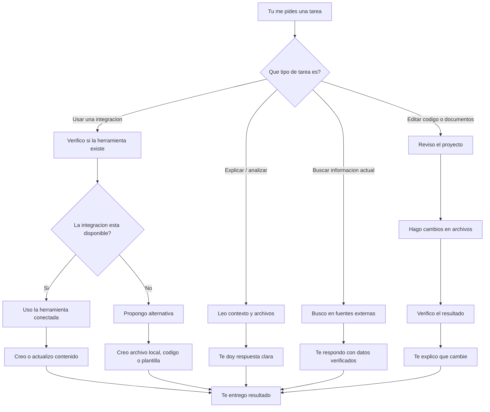

# Flujo de trabajo de Codex



## Que significa en la practica

- Si me pides `explicar`, primero entiendo el contexto y luego te lo resumo.
- Si me pides `hacer`, normalmente reviso archivos, modifico lo necesario y verifico.
- Si me pides `conectarme a una app`, primero confirmo si esa integracion existe aqui.
- Si no existe una integracion directa, puedo crear una alternativa local: Markdown, SVG, HTML, PDF, codigo o documentacion.

## Herramientas con las que si puedo trabajar en este entorno

- `GitHub`
- `Notion`
- `Adobe`
- Navegacion web
- Archivos locales del proyecto
- Generacion de imagenes

## Herramientas que no veo disponibles ahora mismo

- `Miro` no aparece como integracion activa en este entorno.

## Documentos que te puedo crear

- `Markdown` con diagramas Mermaid
- `HTML` visual
- `SVG`
- `PNG` o imagen generada
- `PDF`
- Documentacion tecnica
- Codigo para conectarte a APIs como Miro

## Opcion recomendada

Para explicarte procesos, lo mas rapido es:

1. Crear un `Markdown` con Mermaid.
2. Si quieres algo mas visual, lo convierto a `HTML` o `SVG`.
3. Si necesitas Miro, te preparo el contenido para pegarlo o importarlo alla.
```
